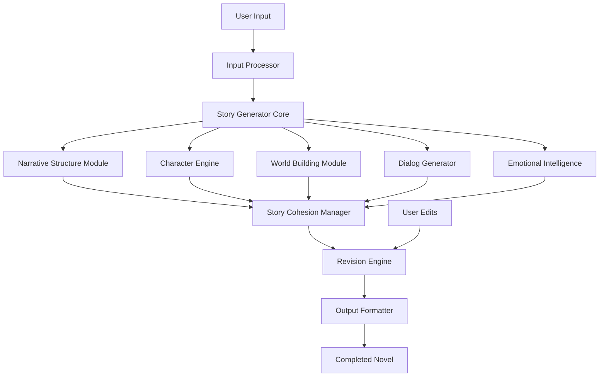
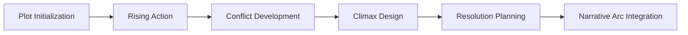
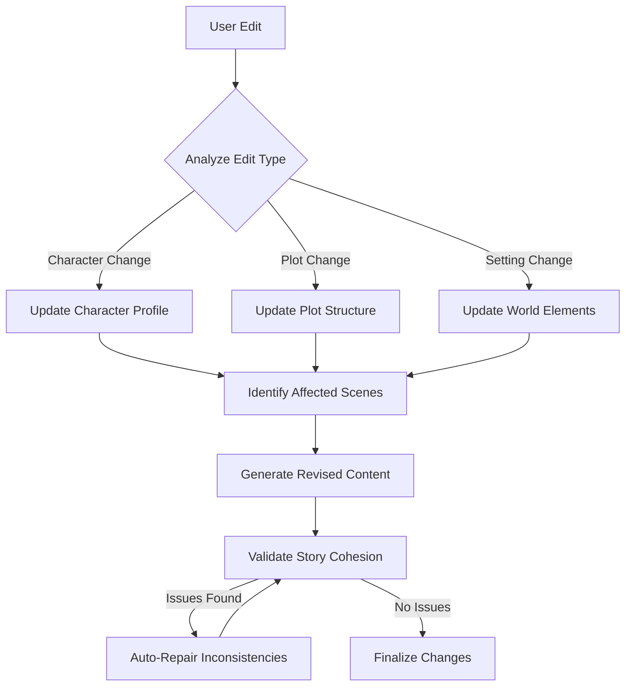
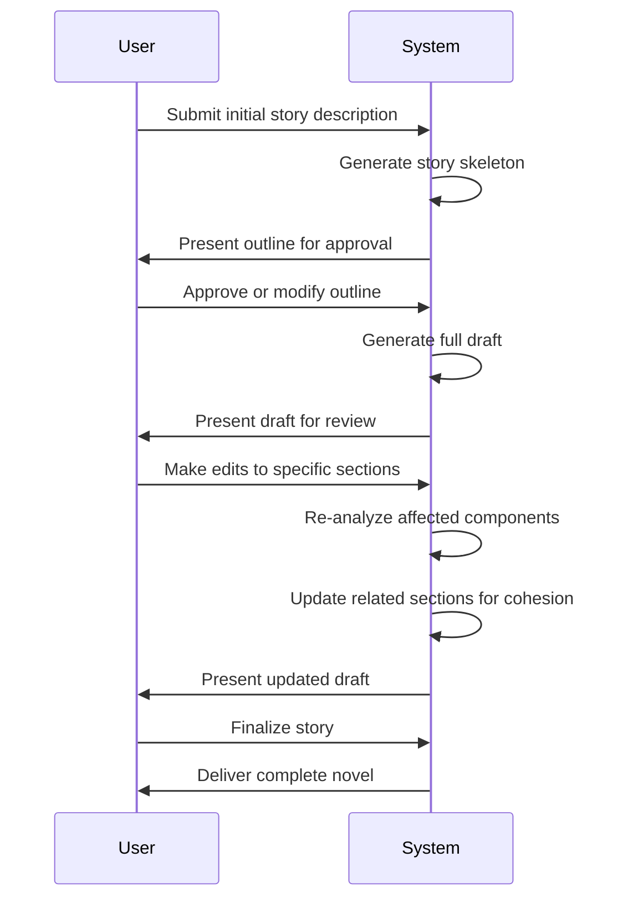

# Lore
Story Data Lore Generate

## StoryForge: AI-Powered Novel Generation Engine

### Overview

StoryForge is an advanced AI-powered story generation system capable of creating complete novels from initial descriptions. The system maintains narrative cohesion, character consistency, and plot integrity while allowing dynamic modifications throughout the creation process.

### Core Features

- **Complete Novel Generation**: Creates full-length novels from minimal input
- **Dynamic Content Adaptation**: Updates entire narrative when any part changes
- **Rich Character Development**: Generates complex characters with consistent personalities
- **Narrative Intelligence**: Crafts coherent plots with proper pacing and structure
- **Contextual World Building**: Creates immersive settings that evolve naturally
- **Emotional Intelligence**: Infuses appropriate emotions into characters and scenes
- **Dialog Generation**: Creates realistic, character-appropriate conversations

### System Architecture

### Component Breakdown

#### 1. Input Processor
Transforms user's initial description into structured data that the system can use to generate story elements.

**Key Functions:**
- Parse user requirements and preferences
- Extract key themes, settings, and character traits
- Set narrative parameters (genre, length, complexity)

#### 2. Story Generator Core
The central AI system that coordinates all aspects of novel creation.

**Key Functions:**
- Manage workflow between components
- Maintain global story context
- Balance different narrative elements

#### 3. Narrative Structure Module
Designs the overall plot architecture.

**Key Functions:**
- Create coherent story arcs
- Manage pacing and tension
- Structure chapters and scenes
- Implement narrative devices (foreshadowing, callbacks)

#### 4. Character Engine
Develops and maintains consistent characters throughout the story.

**Key Functions:**
- Generate character profiles with distinct personalities
- Track character development and relationships
- Ensure consistent character voices and behaviors
- Create character arcs that align with the main narrative

#### 5. World Building Module
Creates immersive settings with cultural, historical, and environmental details.

**Key Functions:**
- Generate coherent world rules and systems
- Create locations that enhance the narrative
- Develop background lore and history
- Implement indirect world-building through context

#### 6. Dialog Generator
Creates realistic conversations between characters.

**Key Functions:**
- Generate character-specific speech patterns
- Create natural dialog flows
- Integrate dialog with plot advancement
- Balance exposition and conversation

#### 7. Emotional Intelligence System
Infuses appropriate emotions into scenes and characters.

**Key Functions:**
- Map emotional arcs for characters and scenes
- Generate emotionally resonant language
- Create emotional contrast and harmony
- Ensure emotional authenticity

#### 8. Story Cohesion Manager
Ensures all elements work together to create a unified narrative.

**Key Functions:**
- Check for plot holes and inconsistencies
- Validate character motivations and actions
- Verify world logic and rule consistency
- Track narrative threads across chapters

#### 9. Revision Engine
Handles updates and modifications to the story.

**Key Functions:**
- Process user edits and modifications
- Identify affected narrative elements
- Propagate changes throughout the story
- Resolve conflicts between edited content and existing content

#### 10. Output Formatter
Prepares the final novel in the desired format.

**Key Functions:**
- Structure chapters and sections
- Format dialog and narrative text
- Apply styling and formatting
- Export to various formats (EPUB, PDF, etc.)

### Implementation Strategy

1. **Data Model Design**
   - Create schemas for characters, locations, plot points
   - Design relationship models between story elements
   - Develop versioning system for story revisions

2. **AI Training Pipeline**
   - Train on corpus of literature for style and structure
   - Develop specialized models for dialog, description, and narration
   - Create evaluation metrics for narrative quality

3. **User Interaction Framework**
   - Design intuitive interfaces for story input and modification
   - Create visualization tools for story structure and character relationships
   - Develop feedback mechanisms for guided story refinement

4. **Cohesion Enforcement**
   - Implement constraint satisfaction algorithms for narrative consistency
   - Develop knowledge graphs to track story elements and relationships
   - Create causal models to understand story logic

### Usage Workflow

### Technical Considerations

- **Large Language Models**: Foundation for text generation with fine-tuning for narrative tasks
- **Graph Databases**: Store and query complex relationships between story elements
- **Constraint Solvers**: Maintain narrative consistency across modifications
- **Vector Embeddings**: Track thematic and stylistic consistency
- **Causal Inference**: Model cause-effect relationships in the narrative

### Future Enhancements

- **Multi-modal outputs**: Illustrations and audio narration
- **Interactive storytelling**: Reader choices affecting narrative paths
- **Style mimicry**: Ability to write in the style of famous authors
- **Collaborative writing**: AI and human co-authoring capabilities
